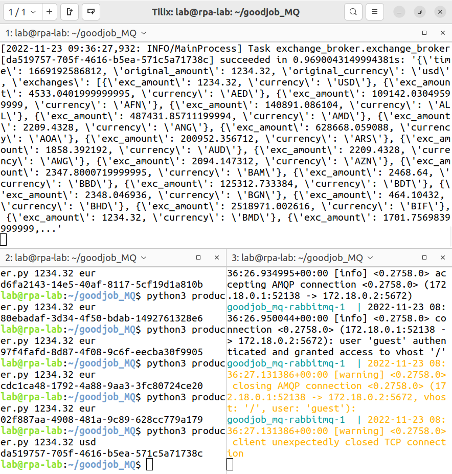

# Ejercicio MQ (GoodJob)



##  Instalación

1er paso, instalar docker
```bash
install docker
curl -fsSL https://get.docker.com -o get-docker.sh
DRY_RUN=1 sudo sh ./get-docker.sh
```

2do paso, crea un venv y instala las dependencias:
```bash
$ python -m venv venv
$ source env/bin/activate

$ pip install -r requirements.txt
```

3er paso, Arranca los servicios redis y rabbitmq con `docker-compose`:
```bash
docker-compose up -d
```

Y verifica si están arrancando:
```bash
$ docker ps
```

Deberia salir algo como asi
```bash
d5f18779c936   rabbitmq:latest   "docker-entrypoint.s…"   About an hour ago   Up About an hour   4369/tcp, 5671/tcp, 15691-15692/tcp, 25672/tcp, 0.0.0.0:5672->5672/tcp, :::5672->5672/tcp   goodjob_mq_rabbitmq_1_b62bedc3cd08
2f86e43d2726   redis:latest      "docker-entrypoint.s…"   About an hour ago   Up About an hour   0.0.0.0:6379->6379/tcp, :::6379->6379/tcp                                                   goodjob_mq_redis_1_35c36467b3a6

```

## Uso
Abre un terminal y arranca el celery worker así:
```bash
$ celery -A exchange_broker worker -l info --pool=solo
```

Envia una tarea en JSON a celery worker:
Abre una terminal con el siguiente comando
```bash
$ python3 producer.py 1234.30 eur
```

